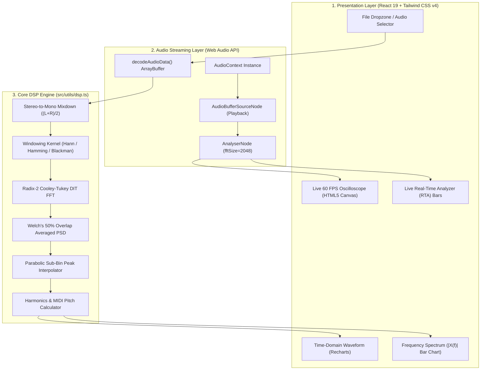

<div align="center">

# 🎵 Audio Frequency Analyzer
### Modern Web Application for Digital Signal Processing (DSP) & Real-Time Spectral Analysis

[](https://audio-frequency-analyzer.vercel.app)
[](https://react.dev/)
[](https://www.typescriptlang.org/)
[](https://vitejs.dev/)
[](https://tailwindcss.com/)
[](https://opensource.org/licenses/MIT)

**[🌐 Live Demo App](https://audio-frequency-analyzer.vercel.app)** • **[📑 Laporan Praktikum PDF](https://github.com/csncoa/audio-frequency-analyzer)** • **[🚀 Quick Start](#-getting-started)**

<br/>


</div>

---

## 📌 Executive Summary

**Audio Frequency Analyzer** is a high-performance, client-side web application engineered for **Digital Signal Processing (DSP / Pengolahan Sinyal Digital)** academic research, university coursework, and live acoustic demonstration. 

The application analyzes uncompressed `.wav` audio signals across both the **time domain (waveform $x(t)$)** and **frequency domain (spectrum $|X(f)|$)** using a custom in-place **Radix-2 Cooley-Tukey Fast Fourier Transform (FFT)**, **Welch's Averaged Modified Periodogram (PSD)**, customizable **windowing kernels** (Hann, Hamming, Blackman, Rectangular), and **quadratic parabolic sub-bin peak interpolation**.

---

## 🌟 Key Features

| Feature | Description | Engineering Details |
|---|---|---|
| ⚡ **Client-Side WAV Decoder** | Decodes raw audio PCM stream directly in the browser via Web Audio API. | Extracts sample rate ($f_s$), duration, total samples ($N$), and channel configuration with zero server latency. |
| 🎛️ **Stereo to Mono Mixdown** | Seamlessly downmixes multi-channel audio tracks. | Implements $x[n] = \frac{L[n] + R[n]}{2}$ to ensure balanced phase representation. |
| 🚀 **Radix-2 Cooley-Tukey FFT** | High-speed Decimation-in-Time (DIT) FFT engine. | Reduces algorithmic complexity from $\mathcal{O}(N^2)$ to $\mathcal{O}(N \log_2 N)$ for $N = 4096$. |
| 🪟 **Windowing Functions** | Attenuates spectral leakage caused by finite-length framing. | Hann ($-31\text{ dB}$ sidelobe), Hamming ($-43\text{ dB}$), Blackman ($-58\text{ dB}$), and Rectangular ($-13\text{ dB}$). |
| 📊 **Welch's Averaged PSD** | Minimizes noise variance across long audio tracks. | Evaluates up to 24 overlapping segments (50% overlap) across multi-minute files. |
| 🎯 **Parabolic Sub-Bin Peak** | Sub-bin quadratic vertex correction. | Achieves frequency detection accuracy below $0.2\text{ Hz}$ across continuous bands. |
| 🎹 **Musical Pitch & Cents** | Automatic 12-Tone Equal Temperament (12-TET) mapping. | Maps fundamental frequency to nearest MIDI note (e.g. `A4`, `C4`) and calculates microtonal deviation in Cents. |
| 📈 **Dual Scale Spectrum** | Linear magnitude and Logarithmic Decibel (dB) scaling. | Real-time toggle with frequency zoom range (1 kHz, 3 kHz, 5 kHz, 10 kHz, 22 kHz). |
| 🌊 **60 FPS Live Visualizers** | Dual Canvas-rendered live visual instruments. | High-resolution Oscilloscope and 64-band Real-Time Spectrum Analyzer (RTA) running at constant 60 FPS. |
| 📄 **Scientific Report Export** | Instant scientific text report export (`.txt`). | Outputs full signal metadata, Nyquist frequency, peak amplitudes, and secondary harmonics. |

---

## 📐 Mathematical Foundations

### 1. Sampling Theorem & Nyquist Limit
To reconstruct a continuous-time signal $x(t)$ without aliasing distortion, the sampling frequency $f_s$ must satisfy:
$$f_s \ge 2 \cdot f_{\max} \implies f_{\text{Nyquist}} = \frac{f_s}{2}$$

For standard audio ($f_s = 44,100\text{ Hz}$), the Nyquist cutoff is $f_{\text{Nyquist}} = 22,050\text{ Hz}$.

### 2. Discrete Fourier Transform (DFT)
Decomposes discrete time sequence $x[n]$ of length $N$ into orthogonal sinusoidal frequency bins $X[k]$:
$$X[k] = \sum_{n=0}^{N-1} x[n] \cdot e^{-j \frac{2\pi}{N} k n}, \quad k = 0, 1, \dots, N-1$$

### 3. Radix-2 Cooley-Tukey Decimation-in-Time (DIT) FFT
Splits input sequence into even and odd indices recursively using Twiddle factors $W_N^k = e^{-j \frac{2\pi}{N} k}$:
$$\begin{aligned}
X[k] &= E[k] + W_N^k \cdot O[k] \\
X\left[k + \frac{N}{2}\right] &= E[k] - W_N^k \cdot O[k], \quad k = 0, 1, \dots, \frac{N}{2}-1
\end{aligned}$$

Reduces computational cost from $\mathcal{O}(N^2)$ to $\mathcal{O}(N \log_2 N)$. For $N = 4096$:
$$\text{DFT Operations: } 4096^2 = 16,777,216 \quad \longrightarrow \quad \text{FFT Butterfly Passes: } \frac{4096}{2} \times 12 = 24,576 \quad (\approx 682\times\text{ faster})$$

### 4. Windowing Kernels (Spectral Leakage Mitigation)
- **Hann Window**:
  $$w_{\text{hann}}[n] = 0.5 \left[ 1 - \cos\left(\frac{2\pi n}{N-1}\right) \right], \quad 0 \le n \le N-1$$
- **Hamming Window**:
  $$w_{\text{hamming}}[n] = 0.54 - 0.46 \cos\left(\frac{2\pi n}{N-1}\right)$$
- **Blackman Window**:
  $$w_{\text{blackman}}[n] = 0.42 - 0.5\cos\left(\frac{2\pi n}{N-1}\right) + 0.08\cos\left(\frac{4\pi n}{N-1}\right)$$

### 5. Parabolic Sub-Bin Peak Interpolation
Corrects discrete bin discretization error using the three highest magnitude bins ($\alpha, \beta, \gamma$):
$$\delta = \frac{1}{2} \cdot \frac{\alpha - \gamma}{\alpha - 2\beta + \gamma}, \qquad f_{\text{peak}} = (k_{\text{peak}} + \delta) \cdot \frac{f_s}{N}$$

### 6. Musical Pitch & Cent Deviation
Calculates continuous MIDI pitch relative to Concert Pitch A4 ($440.0\text{ Hz}$):
$$\text{MIDI} = 69 + 12 \cdot \log_2\left(\frac{f}{440.0}\right)$$
$$\text{Cents} = \text{round}\left( (\text{MIDI} - \text{round}(\text{MIDI})) \times 100 \right)$$

---

## 🏗️ System Architecture



---

## 📦 Getting Started

### Prerequisites
- [Node.js](https://nodejs.org/) (v18.0 or newer recommended, tested on Node.js v24)
- npm or pnpm package manager

### Installation

1. **Clone the repository:**
   ```bash
   git clone https://github.com/csncoa/audio-frequency-analyzer.git
   cd audio-frequency-analyzer
   ```

2. **Install project dependencies:**
   ```bash
   npm install
   ```

3. **Start local development server:**
   ```bash
   npm run dev
   ```
   Open your browser and navigate to `http://localhost:3000` (or the URL printed in terminal).

4. **Compile production build:**
   ```bash
   npm run build
   npm run preview
   ```
   Optimized static assets will be output to the `dist/` directory.

---

## 📂 Project Directory Structure

```text
audio-frequency-analyzer/
├── public/
│   ├── screenshot.png            # Application preview image
│   ├── test_1000hz.wav           # 1000 Hz reference test tone
│   └── test_middle_c.wav         # Middle C (261.63 Hz) piano tone
├── src/
│   ├── components/
│   │   └── LiveVisualizers.tsx   # 60 FPS Canvas Oscilloscope & RTA Bars
│   ├── utils/
│   │   ├── dsp.ts                # Cooley-Tukey FFT, Windowing, Welch PSD
│   │   └── realtimeAudio.ts      # Web Audio API context & node wrapper
│   ├── App.tsx                   # Main application state & interface
│   ├── main.tsx                  # React DOM entrypoint
│   └── index.css                 # Tailwind CSS v4 styling rules
├── package.json                  # Dependencies and build scripts
├── vite.config.ts                # Vite 8 bundler configuration
└── README.md                     # Project documentation
```

---

## 🌐 Deploy to Vercel

The application is fully static and optimized for zero-config Vercel deployment:

[](https://vercel.com/new/clone?repository-url=https://github.com/csncoa/audio-frequency-analyzer)

Alternatively, via Vercel CLI:
```bash
npm install -g vercel
vercel --prod
```

---

## 👨‍💻 Author & Acknowledgments

- **Developed by**: [Christian Nico](https://github.com/csncoa)
- **Institution**: Universitas Negeri Semarang (UNNES)
- **Course**: Pengolahan Sinyal Digital (Digital Signal Processing / DSP)
- **Year**: 2026

## 📄 License

This project is licensed under the **MIT License** — see the [LICENSE](LICENSE) file for details. Free for academic, educational, and research use.
